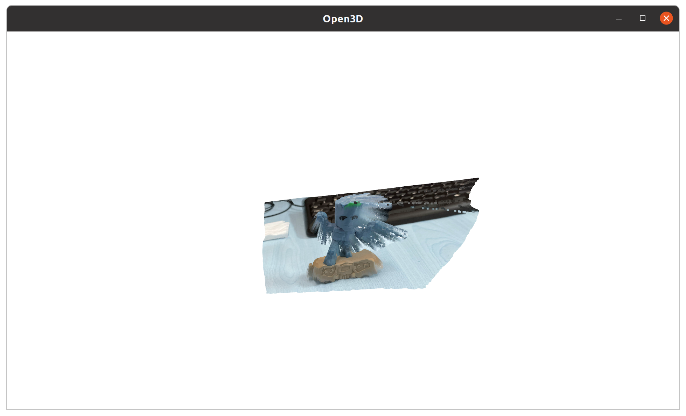

# DepthMatch

## Introduction

1. Monocular depth estimation -> RGB-D (Metric3D)
2. Point cloud reconstruction -> Point Cloud (OpenGL)
3. Point cloud matching -> Relative Pose (ICP)

## Results

### Depth Estimation and Point Cloud Reconstruction

### Point Cloud Matching

